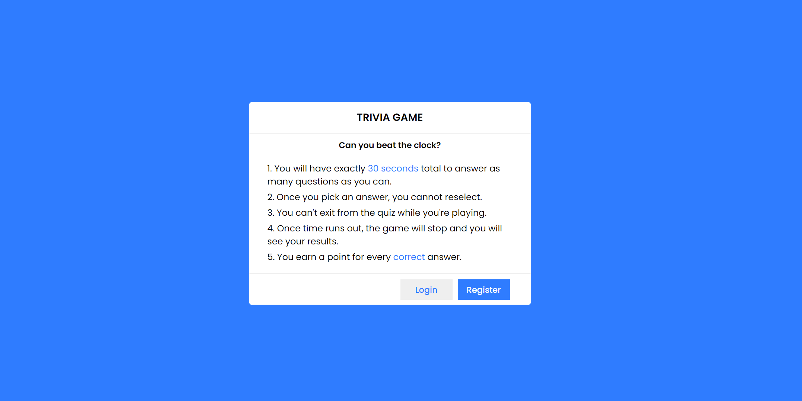

# Smart Study
This is an educational trivia web application created for my class, CPS353 - Software Engineering. The purpose of this application is to give teachers a fun way to quiz their students' knowledge on material learned over their four years of high school. Racing against the clock, students must try to get through as many questions as they can correctly.

## Motivation
My motivation for creating this project is because I'm a big fan of videogames. I grew up playing video games, and even as a senior in college, video games are a big part of my life. Even though this isn't a video game per se, but it brings the idea of gameifed learning to life. Testing a student's knowledge in a fun way to see if they have what it takes to be at the top of the leaderboard. 

## Screenshot 
